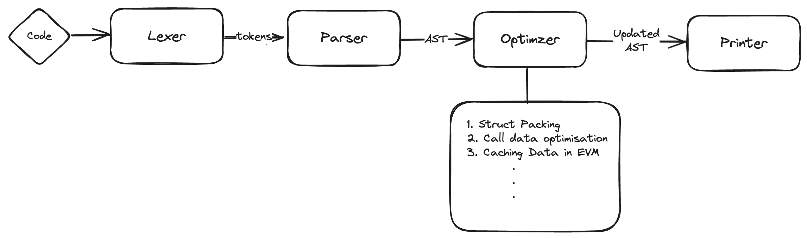

# Docs

# Setup

Running the program: `cargo run`

## Libraries

Logos:

- when using logos, you don't manually manipulate the lexer's current token, but rather define token patterns and let logos do the work of lexing and tokenization for you. If you need to perform additional processing on tokens, you do that at a higher level, usually in a loop that retrieves each token from the lexer.

## Design

Overall Architecture:

### Lexer

Functionality:

- Lexer is the component that takes raw input text and converts it into a stream of tokens. Tokens are the basic building blocks of a language's syntax, such as keywords, identifiers, literals, operators, and punctuation symbols.

To handle struct packing and calldata optimizations, Lexer should recognize and generate tokens for:

- Data type declarations (e.g., uint, address, struct)
- Storage qualifiers (e.g., memory, calldata, storage)
- Function definitions and parameters
- Variable declarations and assignments
- Comments and whitespace (to keep intact)

### Parser

The parser takes the stream of tokens and builds an Abstract Syntax Tree (AST), a tree-like representation of the syntactic structure of the code.

For the optimizations, the parser should:

1. Build nodes for struct definitions, capturing the order and types of fields.
2. Build nodes for function definitions, categorizing them by visibility (public, external, etc.) and whether they are read-only or state-changing.
3. Recognize repeated access to storage variables, to identify opportunities for caching.
   The parser must handle Solidity's grammar accurately to construct a correct AST, which will be traversed during the optimization phase.

### Optimizer

### Printer

- Prints out the optimised Solidity code

Functionality

---

## Gas Optimisation Patterns in Solidity

### Struct Packing

- **Overview**: By reordering variables within structs that use less than 32 bytes to be adjacent to each other, we can save storage space on the Ethereum Virtual Machine (EVM).
- **Benefits**: Storage packing reduces the number of necessary [`SLOAD`](https://github.com/wolflo/evm-opcodes/blob/main/gas.md#a6-sload) or [`SSTORE`](https://github.com/wolflo/evm-opcodes/blob/main/gas.md#a7-sstore) operations, which can cut the cost of accessing storage variables by half or more, especially when multiple values in the same storage slot are read or written at once.
- **Implementation**: A tool or script can be used to analyze Solidity struct definitions and reorder the fields to minimize storage slots. It will keep comments and whitespace intact and handle unknown types as `bytes32`.
- **Reference**: [Struct Packing on GitHub](https://github.com/beskay/gas-guide/blob/main/OPTIMIZATIONS.md#storage-packing)

### Storage Variable Caching

Implementation:

- If there are more than 2 calls to global storage variable, we would declare a temp local variable as the cached value

- **Reference**: https://www.rareskills.io/post/gas-optimization#viewer-8lubg

### Calldata Optimization

- **Cost Efficiency**: Calldata is less expensive than memory, so for external functions where the input argument remains unmodified, using calldata can be more gas-efficient.
- **Reference**: [Calldata Optimization on GitHub](https://github.com/beskay/gas-guide/blob/main/OPTIMIZATIONS.md#calldata-instead-of-memory-for-external-functions)

- Implementation
  - If input arg has `memory`, we check function body to see if variable has writes.
  - If there is no write, change it to `calldata`

---
