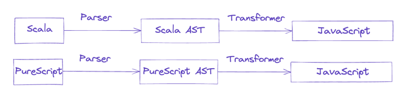
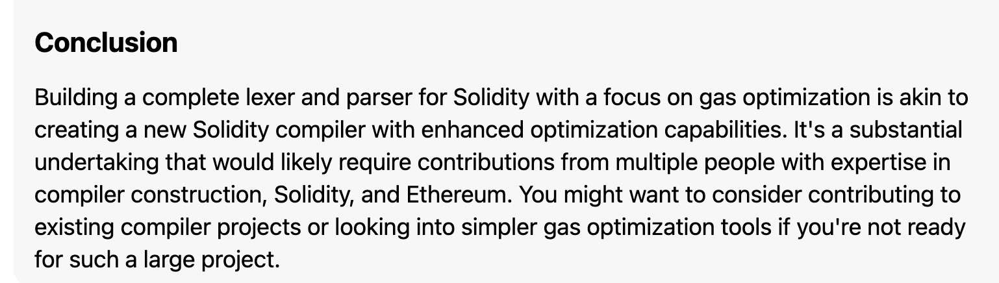

# Research On Implementation

## Design of project

- Each component of the project - parser, gas optimization algorithms should be designed as a separate modules. This allows for other developers to use the parser or the gas optimization algorithms in their own projects.
- Using comments for rustdoc

## Libraries

### Logos

- when using logos, you don't manually manipulate the lexer's current token, but rather define token patterns and let logos do the work of lexing and tokenization for you. If you need to perform additional processing on tokens, you do that at a higher level, usually in a loop that retrieves each token from the lexer.

### Solidity Specifications

- [Lexer Grammer](https://github.com/ethereum/solidity/blob/develop/docs/grammar/SolidityLexer.g4)
- [Parser Grammer](https://github.com/ethereum/solidity/blob/develop/docs/grammar/SolidityParser.g4)

### Arena

- Function: Allocates large memory blocks; Divide memory out into smaller chunks and allocate to objects.
- Benefits: Reduces fragmentation and overhead from many small allocations.
- Usage: Optimize performance where many small, similarly-lived objects are allocated/deallocated.
- Replacement: Substitutes individual `Box` or other heap allocations when grouped deallocation is viable.

Why is it good for us?

- Using an arena simplifies the parser's code by removing the need for individual deallocation logic for each AST node.

> Performance: It improves overall performance by reducing the number of individual allocations and deallocations, which can be costly operations.

> Safety: The arena ensures that all allocated objects have the correct lifetime, preventing dangling references within the scope of the parsing operation.

## Deep Dive into Solidity

### Grammer of Solidity

https://docs.soliditylang.org/en/latest/grammar.html

### How does Solidity compile into EVM Bytecode?

### Gas Optimisation Patterns in Solidity

#### Struct Packing

- **Overview**: By reordering variables within structs that use less than 32 bytes to be adjacent to each other, we can save storage space on the Ethereum Virtual Machine (EVM).
- **Benefits**: Storage packing reduces the number of necessary [`SLOAD`](https://github.com/wolflo/evm-opcodes/blob/main/gas.md#a6-sload) or [`SSTORE`](https://github.com/wolflo/evm-opcodes/blob/main/gas.md#a7-sstore) operations, which can cut the cost of accessing storage variables by half or more, especially when multiple values in the same storage slot are read or written at once.
- **Implementation**: A tool or script can be used to analyze Solidity struct definitions and reorder the fields to minimize storage slots. It will keep comments and whitespace intact and handle unknown types as `bytes32`.
- **Reference**: [Struct Packing on GitHub](https://github.com/beskay/gas-guide/blob/main/OPTIMIZATIONS.md#storage-packing)

#### Storage Variable Caching

Implementation:

- If there are more than 2 calls to global storage variable, we would declare a temp local variable as the cached value

- **Reference**: https://www.rareskills.io/post/gas-optimization#viewer-8lubg

#### Calldata Optimization

- **Cost Efficiency**: Calldata is less expensive than memory, so for external functions where the input argument remains unmodified, using calldata can be more gas-efficient.
- **Reference**: [Calldata Optimization on GitHub](https://github.com/beskay/gas-guide/blob/main/OPTIMIZATIONS.md#calldata-instead-of-memory-for-external-functions)

- Implementation
  - If input arg has `memory`, we check function body to see if variable has writes.
  - If there is no write, change it to `calldata`

---

#### Fixed Size vs. Dynamic Size Variables

- **Best Practice**: Use fixed size variables (`bytes1` to `bytes32`) over dynamic ones (`bytes`, `string`) when the size can be predetermined, as they consume less gas.
- **Arrays**: Opt for fixed-size arrays instead of dynamic arrays if you know the maximum number of elements, to save a storage slot otherwise used for the length parameter.

**Not implemented in the project, but possible future works:**

#### Tight Variable Packing

- **Overview**: Gas costs can be reduced by using smaller data types (like `bytes16`, `uint32`) to enable the EVM to pack these variables tightly into a single 32-byte storage slot.
- **Note**: This optimization, known as "tight packing", is not automatically performed by the Solidity optimizer as of the last update.
- **Reference**: [Tight Variable Packing](https://fravoll.github.io/solidity-patterns/tight_variable_packing.html)

#### Function Ordering

- **Function Selector Cost**: The EVM processes function selectors in hexadecimal order, with each jump to find a matching selector costing 22 gas.
- **Optimization Tip**: Reorder functions so that the most frequently called ones come first, reducing the average cost of function lookups.

By applying these strategies, smart contract developers can write more gas-efficient code, reducing the overall cost of deploying and interacting with contracts on the Ethereum network.

#### Using Multiplication over Exponetentiation: MUL vs EXP

- **MUL Opcode**: This operation costs a fixed amount of 5 gas and is used for multiplication. For example, `10 * 10` would cost 5 gas.
- **EXP Opcode**: Exponentiation costs are higher and variable. The cost is 10 gas for an exponent of zero. If the exponent is non-zero, the cost is 10 gas plus an additional 50 gas for every byte in the exponent. This can add up quickly depending on the size of the exponent.

  - For `10¹⁸`, the cost would be `10 + 50 * 1 = 60` gas.
  - For `10³⁰⁰`, the cost would be `10 + 50 * 2 = 110` gas.

##### Practical Example in Solidity

```solidity
contract SquareExample {
    uint256 public x;

    constructor(uint256 _x) {
        x = _x;
    }

    // Inefficient method using exponentiation
    function inefficientSquare() external {
        x = x**2; // Costs significantly more gas
    }

    // Efficient method using multiplication
    function efficientSquare() external {
        x = x * x; // Costs significantly less gas
    }
}
```

- **InefficientSquare**: The `inefficientSquare` function uses exponentiation, which, as shown in the example, costs `60` gas for the arithmetic operation alone.
- **EfficientSquare**: The `efficientSquare` function uses multiplication, costing only `5` gas for the arithmetic operation.

#### Caching Data in EVM: `SLOAD` vs. `MLOAD`

- **`SLOAD` (Storage Load)**:

  - First access to a storage slot within a transaction: **2100 gas**
  - Subsequent accesses to the same storage slot: **100 gas**

- **`MLOAD` (Memory Load)**:
  - Consistently costs **3 gas** regardless of the number of accesses

##### Gas Savings Example

```solidity
contract StorageExample {
    uint256 sumOfArray;

    // Inefficient function that uses storage for intermediate calculations
    function inefficientSum(uint256[] memory _array) public {
        for (uint256 i; i < _array.length; i++) {
            // Uses SLOAD and SSTORE in each iteration
            sumOfArray += _array[i];
        }
    }

    // Efficient function that uses a memory variable for intermediate calculations
    function efficientSum(uint256[] memory _array) public {
        uint256 tempVar;
        for (uint256 i; i < _array.length; i++) {
            tempVar += _array[i]; // Only MLOAD is used here
        }
        // Uses SSTORE only once to update storage
        sumOfArray = tempVar;
    }
} // end of StorageExample
```

- **`inefficientSum`**:

  - Each iteration performs an `SLOAD` to read `sumOfArray`, modifies it in EVM memory, and then performs an `SSTORE` to write back to storage.
  - Even with the reduced gas cost for subsequent `SLOAD` operations, this is quite expensive due to the high cost of `SSTORE`.

- **`efficientSum`**:
  - Utilizes a local memory variable `tempVar` for all intermediate calculations. Memory operations are cheaper than storage.
  - Only after all calculations does it use a single `SSTORE` to update `sumOfArray` in storage.

##### Gas Savings Analysis

- **`inefficientSum`** incurs high gas costs due to repeated storage operations (`SLOAD` and `SSTORE`) within the loop.
- **`efficientSum`** dramatically reduces gas costs by:
  - Minimizing `SLOAD` operations, as `tempVar` is in memory and doesn't require `SLOAD`.
  - Reducing `SSTORE` operations to just one, at the end of the function.

With an array of only 10 integers, `efficientSum` can save more than 50% of the gas costs compared to `inefficientSum`. As the size of the array grows, the savings become even more pronounced. This is because the cost of `SLOAD` operations would remain the same regardless of the array size, but the cost of `SSTORE` operations would increase linearly with the number of iterations in `inefficientSum`.

## Possible Approaches

### Static Analysis

- Can we build a static analysis tool for gas?

Some existing tools:

- [A Security Analysis Tool for Smart Contract Out-of-Gas Vulnerabilities](https://gasgauge.github.io)
- [GaSaver: A Static Analysis Tool for Saving Gas](https://ieeexplore.ieee.org/document/9946440)

#### Implementation of Static Analysis

1. Lexical Analysis

- Lexer breaks source code into a sequence of tokens.
- Tokens represent the smallest unit of meaning in a programming language, such as keywords, identifiers, operators, and literals.

2. Parser

- A parser takes the sequence of tokens produced by the lexer and constructs a AST (Abstract Syntax Tree), which represents the syntactic structure of the source code.
- The most important keyword here is standardized, which is one of the main characteristics an AST should respect to be useful. As the AST is an intermediary data structure, the overall goal is to be able to transform the tree to anything we want for example transform the tree to produce a program in an entirely new language e.g. generating JavaScript from Scala or most commonly JavaScript from TypeScript, etc 😎
- This standardized format has the advantage of allowing any type of Parser (written using any programming language) to produce a common AST (following the ESTree spec) that can be then interpreted by any Interpreter (written in any language).



3. Semantic Analysis

- The semantic analysis phase checks the AST for semantic errors and gathers information about the program that is not readily available from the syntax alone.

4. Data Flow Analysis

- Data flow analysis is a technique used to gather information about the possible set of values calculated at various points in a computer program.
- Another useful lint which can be applied at this level is cyclomatic complexity, i.e. how "complex" a function/procedure is. This is normally just a case of walking the body of a function and counting the number of branches, loops, and try/catch blocks encountered.



#### Existing Tools for Static Analysis in Solidity

### Solidity Source Code Analysis

- How can we parse Solidity source code?

## Domain Knowledge

### What are smart contracts? What is solidity?

Smart contracts are self-executing contracts with the terms of the agreement between buyer and seller being directly written into lines of code. These contracts are stored on a blockchain and automatically enforce the terms of the agreement. Solidity is the primary programming language used for developing smart contracts on the Ethereum blockchain. It is an object-oriented, high-level language designed to target the Ethereum Virtual Machine (EVM) and is influenced by C++, Python, and JavaScript.

Solidity is used to write programs that govern the behavior of accounts within the Ethereum state. It supports features such as inheritance, libraries, and complex user-defined types. Smart contracts, on the other hand, are programs that automate processes and govern the behavior of accounts within the Ethereum state.

EVM Blockchain includes Ethereum, Polygon, Avalanche, Mantle ...

### What is gas and why is optimising gas necessary for blockchain?

Gas in the context of blockchain, particularly Ethereum, refers to the "fuel" that powers smart contract execution and transactions. It is a unit that measures the amount of computational effort required to perform operations on the blockchain network.

Gas is necessary for several reasons:

1. Preventing infinite computations: Gas ensures that computations on the blockchain are not infinite and can be completed within a reasonable amount of time. Without gas, malicious actors could create smart contracts or transactions that run forever, potentially causing the network to grind to a halt.

2. Mitigating spam and abuse: By requiring users to pay for gas, the blockchain network discourages spamming and abuse. Users need to spend a certain amount of cryptocurrency (Ether in the case of Ethereum) to execute actions on the network. This economic cost helps prevent malicious actors from overwhelming the network with frivolous or malicious transactions.

3. Resource allocation: Gas plays a role in resource allocation on the blockchain. Miners or validators prioritize transactions with higher gas fees because they earn those fees as a reward for including transactions in a block. This mechanism incentivizes users to set appropriate gas fees and helps allocate network resources efficiently.

Gas optimization is necessary for several reasons:

1. Cost reduction: Optimizing gas usage helps reduce the cost of executing smart contracts and transactions. Gas fees are paid in cryptocurrency, so minimizing gas consumption can make blockchain interactions more affordable for users.

2. Efficiency: Gas optimization improves the efficiency of blockchain networks. By reducing the amount of computational effort required for operations, transactions can be processed more quickly, and smart contracts can execute more efficiently.

3. Scalability: Gas optimization is crucial for scalability. By minimizing gas consumption, more transactions can be processed within a given block limit, leading to increased network throughput and improved scalability.

4. Enhanced user experience: Gas optimization can improve the user experience by reducing wait times and costs associated with executing transactions. It enables smoother and more cost-effective interactions with the blockchain.

To optimize gas usage, developers and users employ various techniques such as minimizing on-chain data, reducing complex computations, limiting external calls, using memory efficiently, applying looping carefully, implementing lazy evaluation, and optimizing data structures. These techniques help reduce gas consumption, improve efficiency, and make blockchain networks more scalable and cost-effective.

### Why Rust?

- Blazing Fast
- Strongly Typed
- Just for fun

## References

- [Static analyzer in rust](https://www.michaelfbryan.com/static-analyser-in-rust/book/lex.html)

**Gas**

https://www.rareskills.io/post/gas-optimization
https://github.com/ROOTBABU/solidity-gas-optimization-handbook
https://github.com/beskay/gas-guide/blob/main/OPTIMIZATIONS.md#calldata-instead-of-memory-for-external-functions
https://github.com/0xisk/awesome-solidity-gas-optimization
https://github.com/0xisk/awesome-solidity-gas-optimization

**compilers**

https://medium.com/coinmonks/solidity-compiler-and-llvm-optimizations-3a148a6dbd91

**Solidity library generator for compact struct encoding on the stack**

https://github.com/d1ll0n/stack-packer

**Libraries for optimisations**

https://github.com/RensR/Spack
https://github.com/ShyftNetwork/shyft_tetrix
